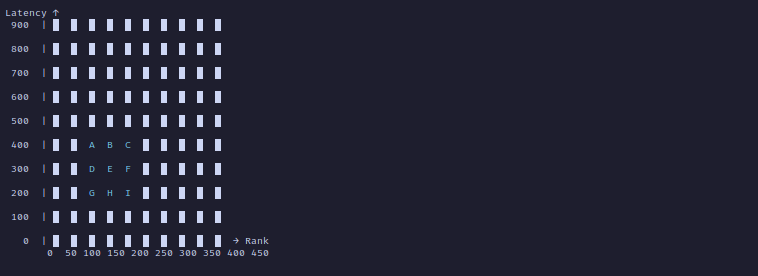

# Vinom Matchmaker  

Vinom Matchmaker is a Redis-based game matchmaking system I developed for the **Vinom project**. It features an interesting solution, and I believe this is the only development project where I applied my DSA  knowledge.  

## How Does It Work?  

It creates separate queues (similar to **bucket sort**) where the queue key is structured as **scaled-rank:scaled-latency**. The reason for **scaling** is to allow a **tolerable rank and latency difference**.  

Every time a player requests a match, we **check if there are enough matchable players** in the existing queues.  

How do we check?  
You can think of the **queues as a 2D grid**.  

Take the table below as an example. Let's assume **A, B, C, D, E, F, G, H, and I** were already in their own queues.  
- When a **new request (E)** comes in, we add it to its queue.  
- Then, we collect all players in the neighboring queues that fall within the tolerable range.  
- These players are then sorted based on waiting time, and a configured number of players are dequeued** to send a create match game room request.  

By using queues based on latency and rank, we effectively avoid searching through all waiting players—instead, we only check 9 queues at max. Clever, right? 💥  

Thanks to Redis distributed lock keys, we can also ensure that other queues are not affected during this process.  

### Example: **Latency Tolerance of 100, Rank Tolerance of 50**  

  

---

Note: Dancing is key.

  
